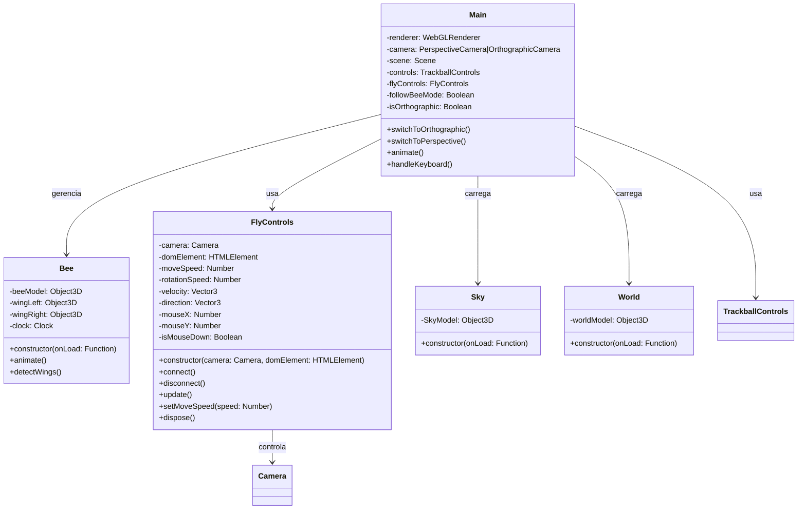
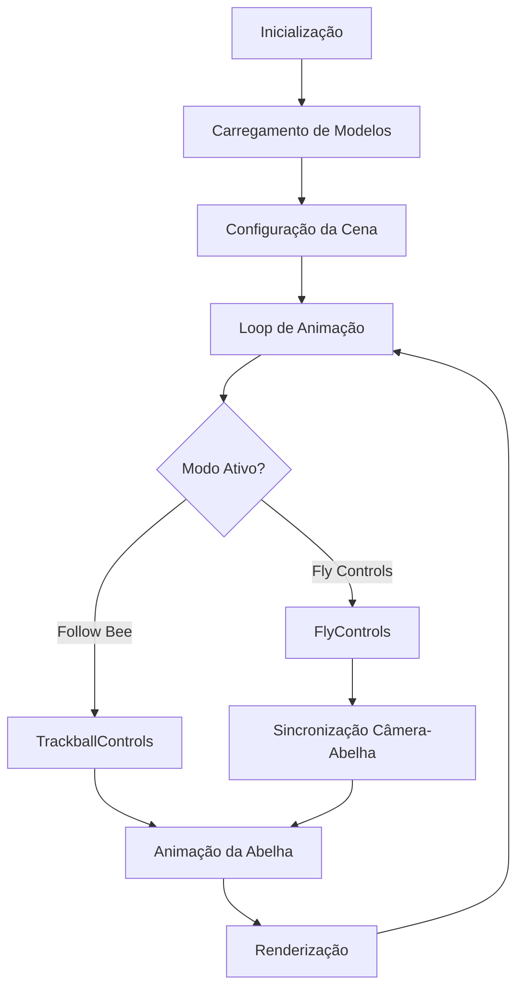

# 🐝 BeeCraft - Minecraft Bee Flight Simulator

Um simulador de voo de abelha 3D interativo inspirado no universo Minecraft, construído com Three.js e WebGL. Experimente voar como uma abelha ou observe seu voo em terceira pessoa em um ambiente completamente renderizado.

<div align="center">

[](https://developer.mozilla.org/en-US/docs/Web/JavaScript)
[](https://threejs.org/)
[](https://www.khronos.org/webgl/)
[](LICENSE)

</div>

---

## 📖 Sumário

- [✨ Características](#-características)
- [🎮 Demo e Controles](#-demo-e-controles)
- [🛠️ Tecnologias](#️-tecnologias)
- [📋 Requisitos](#-requisitos)
- [🚀 Instalação e Execução](#-instalação-e-execução)
- [🏗️ Arquitetura do Projeto](#️-arquitetura-do-projeto)
- [🎯 Funcionalidades Técnicas](#-funcionalidades-técnicas)
- [🔧 API e Configurações](#-api-e-configurações)
- [🎨 Sistema de Animação](#-sistema-de-animação)
- [💡 Desafios Técnicos](#-desafios-técnicos)
- [🤝 Contribuindo](#-contribuindo)
- [📚 Referências](#-referências)

---

## ✨ Características

### 🎮 Experiência Interativa
- **Dois modos de controle**: Follow Bee (terceira pessoa) e Fly Controls (primeira pessoa)
- **Alternância de projeção**: Perspectiva e Ortográfica em tempo real
- **Pointer Lock**: Controle imersivo com mouse capturado no modo voo
- **Transições suaves**: Mudanças fluidas entre modos sem perda de estado

### 🐝 Modelo 3D Animado
- **Detecção automática de asas**: Sistema inteligente de identificação de componentes
- **Animações procedurais**: Batimento de asas realístico com variações de fase
- **Movimento flutuante**: Oscilações naturais do corpo da abelha
- **Sincronização**: Abelha segue a câmera com interpolação suave

### 🌍 Ambiente Minecraft
- **Skybox dinâmico**: Céu do Minecraft com iluminação natural
- **Mundo 3D**: Ambiente overworld completo e exploração livre
- **Sistema de sombras**: Sombras realísticas habilitadas globalmente
- **Iluminação ambiente**: Configuração otimizada para visualização

---

## 🎮 Demo e Controles

### ⌨️ Teclas de Atalho
| Tecla | Função |
|-------|--------|
| **F** | Alternar entre Follow Bee ↔ Fly Controls |
| **P** | Ativar câmera em perspectiva |
| **O** | Ativar câmera ortográfica |

### 🎯 Modo Follow Bee (Padrão)
- **Mouse**: Clique e arraste para orbitar ao redor da abelha
- **Scroll**: Zoom in/out
- **Botão direito**: Pan (deslocamento lateral)
- **Foco**: Câmera sempre acompanha a abelha

### 🚁 Modo Fly Controls
- **Mouse**: Movimento controla direção de voo
- **Clique esquerdo**: Ativa Pointer Lock para controle imersivo
- **Movimento**: Abelha segue a câmera automaticamente
- **Física**: Movimento contínuo para frente com controle direcional
- **Implementação**: Sistema de voo baseado em física de movimento 3D

---

## 🛠️ Tecnologias

### Core
- **[Three.js](https://threejs.org/)** `r128` - Engine de renderização 3D
- **WebGL 2.0** - API de renderização gráfica
- **JavaScript ES6+** - Programação moderna com modules

### Loaders e Controles
- **GLTFLoader** - Importação de modelos 3D (.glb)
- **TrackballControls** - Controles orbitais da câmera
- **FlyControls** - Sistema customizado de voo (implementação própria)

### APIs Web
- **Pointer Lock API** - Captura de mouse para controle imersivo
- **RequestAnimationFrame** - Loop de animação otimizado
- **ES6 Modules** - Sistema modular de importação

---

## 📋 Requisitos

### 🌐 Navegadores Suportados
| Navegador | Versão Mínima | Status |
|-----------|---------------|--------|
| Chrome | 90+ | ✅ Recomendado |
| Firefox | 88+ | ✅ Suportado |
| Safari | 14+ | ✅ Suportado |
| Edge | 90+ | ✅ Suportado |

### 💻 Hardware Recomendado
- **GPU**: Suporte a WebGL 2.0 obrigatório
- **RAM**: Mínimo 4GB (8GB recomendado)
- **Processador**: CPU moderna para 60fps estáveis
- **Resolução**: Otimizado para displays HD/Full HD

### 📁 Recursos Necessários
```
models/
├── bee_minecraft.glb          # Modelo da abelha
├── skybox_minecraft_daylight.glb  # Skybox
└── minecraft_overworld.glb   # Mundo
```

---

## 🚀 Instalação e Execução

### 1️⃣ Clone o Repositório
```bash
git clone https://github.com/StephanyeCunto/ComputacaoGrafica.git
cd beecraft
```

### 2️⃣ Estrutura de Arquivos
```
BeeCraft/
├── src/
│   ├── main.js           # Controlador principal
│   ├── Bee.js           # Classe da abelha
│   ├── FlyControls.js   # Controles de voo
│   ├── Sky.js           # Skybox
│   └── World.js         # Mundo 3D
├── models/              # Modelos 3D (*.glb)
├── index.html           # Página principal
└── README.md
```

### 3️⃣ Servir Arquivos

1. Clone o repositório:
   ```bash
   git clone https://github.com/StephanyeCunto/ComputacaoGrafica
   ```

2. Navegue até a pasta do projeto:
   ```bash
   cd beecraft
   ```

3. Instale as dependências:
   ```bash
   npm install
   ```

4. Execute o servidor de desenvolvimento:
   ```bash
   npm start
   ```

5. Abra o navegador e acesse `http://localhost:3000`
---

## 🏗️ Arquitetura do Projeto

### 📊 Diagrama de Classes



### 🔄 Fluxo de Execução



---

## 🎯 Funcionalidades Técnicas

### ✈️ Sistema de Voo Implementado

O sistema de voo do BeeCraft foi desenvolvido com uma abordagem de **física 3D realística**, implementando conceitos de aviação e movimento espacial:

#### 🎮 Mecânicas de Voo

```javascript
update() {
    // Controle direcional baseado na posição do mouse
    this.direction.set(0, 0, 0);
    
    // Movimento horizontal (yaw) - baseado no eixo X do mouse
    if (Math.abs(this.mouseX) > 0.1) {
        this.direction.x = this.mouseX * this.moveSpeed;
    }
    
    // Movimento vertical (pitch) - baseado no eixo Y do mouse
    if (Math.abs(this.mouseY) > 0.1) {
        this.direction.y = this.mouseY * this.moveSpeed;
    }
    
    // Movimento para frente constante (thrust)
    this.direction.z = -this.moveSpeed;
    
    // Aplicação da rotação da câmera ao vetor de movimento
    this.velocity.copy(this.direction);
    this.velocity.applyQuaternion(this.camera.quaternion);
    
    // Atualização da posição da câmera
    this.camera.position.add(this.velocity);
}
```

#### 🔄 Rotação e Orientação

```javascript
onMouseMove(event) {
    const movementX = event.movementX || 0;
    const movementY = event.movementY || 0;
    
    if (this.isMouseDown) {
        // Sistema de rotação usando Euler angles
        const euler = new THREE.Euler(0, 0, 0, 'YXZ');
        euler.setFromQuaternion(this.camera.quaternion);
        
        // Rotação horizontal (yaw)
        euler.y -= movementX * this.rotationSpeed;
        
        // Rotação vertical (pitch) com limitação
        euler.x -= movementY * this.rotationSpeed;
        euler.x = Math.max(-Math.PI / 2, Math.min(Math.PI / 2, euler.x));
        
        // Aplicação da rotação
        this.camera.quaternion.setFromEuler(euler);
    }
}
```

#### 🐝 Características do Voo

- **Thrust Constante**: Movimento contínuo para frente simula propulsão das asas
- **Controle Direcional**: Mouse controla pitch e yaw como em simuladores de voo
- **Limitação de Pitch**: Previne loops verticais (-90° a +90°)
- **Threshold de Movimento**: Evita micro-movimentos acidentais (>0.1)
- **Interpolação Suave**: Abelha segue a câmera com lerp/slerp para movimento natural

### 

#### Câmera Perspectiva
```javascript
const camera = new THREE.PerspectiveCamera(
    75,                              // FOV
    window.innerWidth / window.innerHeight, // Aspect Ratio
    0.1,                            // Near Plane
    2000                            // Far Plane
);
```

#### Câmera Ortográfica
```javascript
const frustumSize = 400;
const aspect = window.innerWidth / window.innerHeight;
const camera = new THREE.OrthographicCamera(
    frustumSize * aspect / -2,  // Left
    frustumSize * aspect / 2,   // Right
    frustumSize / 2,           // Top
    frustumSize / -2,          // Bottom
    0.1,                       // Near
    2000                       // Far
);
```

### 🎮 Sistema de Controles

#### TrackballControls (Follow Bee)
- Orbita ao redor da abelha
- Zoom suave com scroll
- Pan com botão direito
- Rotação livre em todos os eixos

#### FlyControls (Primeira Pessoa)
- Movimento baseado na posição do mouse
- Pointer Lock para imersão total
- Threshold de 0.1 para evitar movimento acidental
- Limitação de rotação vertical (-90° a +90°)

### 🔄 Sincronização Abelha-Câmera

```javascript
if (flyControls) {
    flyControls.update();
    
    // Posição relativa à câmera
    const cameraOffset = new THREE.Vector3(10, -5, -50);
    cameraOffset.applyQuaternion(camera.quaternion);
    const targetBeePosition = camera.position.clone().add(cameraOffset);
    
    // Interpolação suave
    bee.beeModel.position.lerp(targetBeePosition, 0.08); // Posição
    bee.beeModel.quaternion.slerp(camera.quaternion, 0.1); // Rotação
}
```

---

## 🔧 API e Configurações

### ⚙️ Configurações do FlyControls

```javascript
const flyControls = new FlyControls(camera, renderer.domElement);

// Velocidade de movimento (0.1 - 10.0)
flyControls.setMoveSpeed(0.5);

// Sensibilidade de rotação (0.0001 - 0.01)
flyControls.setRotationSpeed(0.002);

// Obter velocidade atual
const currentSpeed = flyControls.getMoveSpeed();
```

### 🎨 Configurações de Renderização

```javascript
const renderer = new THREE.WebGLRenderer({ 
    antialias: true,           // Anti-aliasing ativo
    powerPreference: "high-performance" // GPU dedicada
});

renderer.setPixelRatio(window.devicePixelRatio); // Resolução nativa
renderer.shadowMap.enabled = true;               // Sombras ativas
renderer.shadowMap.type = THREE.PCFSoftShadowMap; // Sombras suaves
```

### 💡 Sistema de Iluminação

```javascript
// Luz ambiente global
const ambientLight = new THREE.AmbientLight(0xdad8d6, 3);
scene.add(ambientLight);

// Sombras automáticas para todos os meshes
model.traverse((child) => {
    if (child.isMesh) {
        child.castShadow = true;    // Projeta sombra
        child.receiveShadow = true; // Recebe sombra
    }
});
```

---

## 🎨 Sistema de Animação

### 🐝 Animação das Asas

```javascript
animate() {
    const time = this.clock.getElapsedTime();
    
    // Configurações de batimento
    const flapFrequency = 2;                           // 2 Hz
    const flapAngle = Math.sin(time * flapFrequency) * 0.6; // ±34.4°
    const phaseOffset = Math.sin(time * 2) * 0.05;    // Variação natural
    
    // Aplicação às asas
    this.wingLeft.rotation.z = flapAngle + phaseOffset;
    this.wingRight.rotation.z = -flapAngle - phaseOffset;
    
    // Espelhamento da asa esquerda
    this.wingLeft.scale.x = -1;
}
```

### 🌊 Movimento Flutuante

```javascript
// Oscilação vertical do corpo
this.beeModel.position.y += Math.sin(time * 2) * 0.3;

// Rotações sutis para movimento natural
this.beeModel.rotation.x += Math.sin(time * 1.5) * 0.002; // Pitch
this.beeModel.rotation.z += Math.sin(time * 1.8) * 0.001; // Roll
```

### 🔍 Detecção Automática de Componentes

```javascript
// Busca inteligente por componentes das asas
this.beeModel.traverse((child) => {
    if (child.name === "RingL_4" || child.name === "WingLeft") {
        this.wingLeft = child;
    } else if (child.name === "RingR_5" || child.name === "WingRight") {
        this.wingRight = child;
    }
});
```

---

## 💡 Desafios Técnicos

### 🔧 Problemas Resolvidos

#### 1. **Detecção Automática de Asas**
- **Desafio**: Identificar componentes corretos no modelo GLTF hierárquico
- **Solução**: Sistema de busca por nomes específicos durante traverse
- **Implementação**: Suporte a múltiplas convenções de nomenclatura

#### 2. **Controles Responsivos**
- **Desafio**: Movimento intuitivo baseado em posição do mouse
- **Solução**: Conversão de coordenadas de tela para direção 3D
- **Otimização**: Threshold de 0.1 para evitar micro-movimentos

#### 3. **Transições Entre Modos**
- **Desafio**: Alternar sistemas de controle sem perder estado
- **Solução**: Preservação de posição/rotação durante recriação
- **Benefício**: Experiência fluida para o usuário

#### 4. **Sincronização Suave**
- **Desafio**: Abelha seguindo câmera sem movimentos bruscos
- **Solução**: Interpolação lerp/slerp com diferentes taxas
- **Resultado**: Movimento natural e cinematográfico

### ⚡ Otimizações de Performance

```javascript
// Reutilização de objetos Vector3
const cameraOffset = new THREE.Vector3(10, -5, -50);
const targetBeePosition = camera.position.clone().add(cameraOffset);

// Interpolação otimizada
bee.beeModel.position.lerp(targetBeePosition, 0.08); // 8% por frame
bee.beeModel.quaternion.slerp(camera.quaternion, 0.1); // 10% por frame
```

---

## 📚 Referências

### 📖 Documentação Oficial
- [Three.js Documentation](https://threejs.org/docs/) - Documentação completa
- [WebGL Specification](https://www.khronos.org/webgl/) - Especificação WebGL
- [GLTF Format](https://www.khronos.org/gltf/) - Formato de modelo 3D

### 🔧 APIs e Bibliotecas
- [Pointer Lock API](https://developer.mozilla.org/en-US/docs/Web/API/Pointer_Lock_API) - Controle de mouse
- [TrackballControls](https://threejs.org/docs/#examples/en/controls/TrackballControls) - Controles orbitais
- [GLTFLoader](https://threejs.org/docs/#examples/en/loaders/GLTFLoader) - Carregador de modelos

### 🎓 Tutoriais e Recursos
- [Three.js Journey](https://threejs-journey.com/) - Curso completo
- [WebGL Fundamentals](https://webglfundamentals.org/) - Fundamentos WebGL
- [Three.js Examples](https://threejs.org/examples/) - Exemplos oficiais

---

<div align="center">

### 🐝 BeeCraft - Voe como uma abelha no Minecraft!

**Desenvolvido com ❤️ usando Three.js e WebGL**
---

**© 2025 BeeCraft** • Projeto desenvolvido como projeto para a disciplina de Computação Gráfica

</div>
