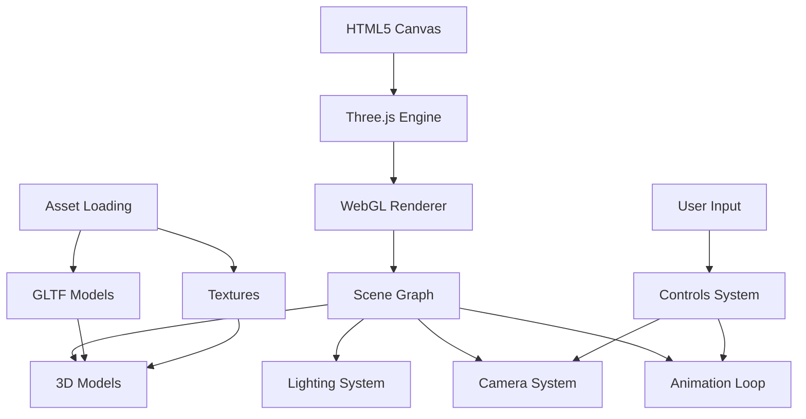
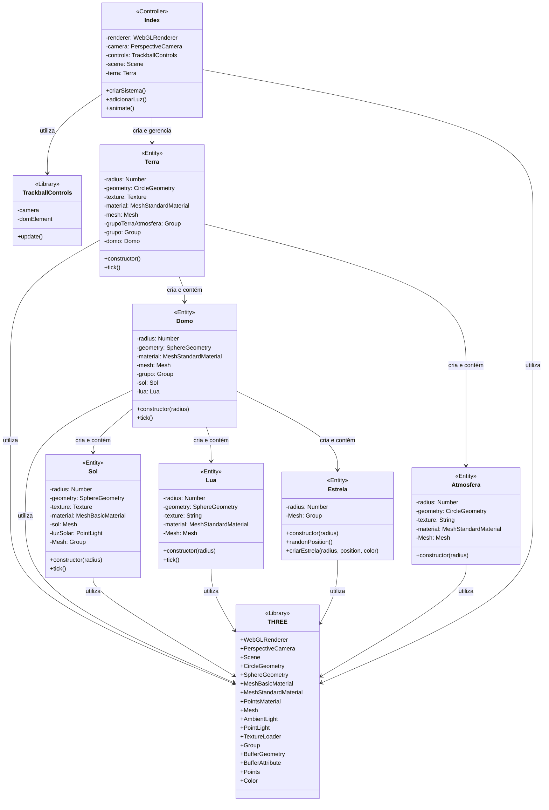
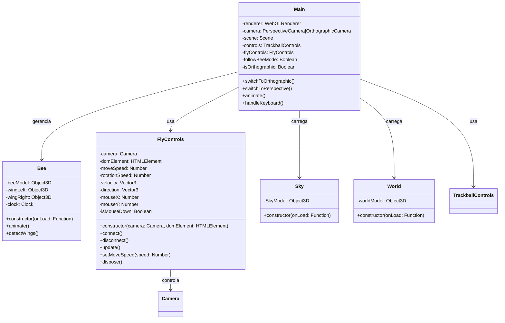
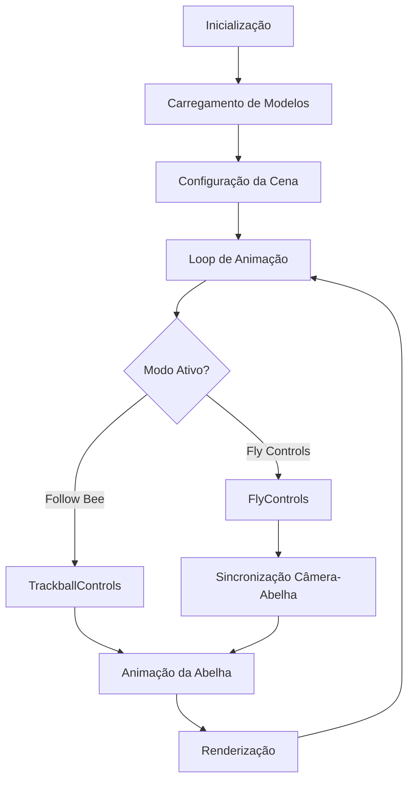

# Repositório de Computação Gráfica

Este repositório contém trabalhos desenvolvidos para a disciplina de Computação Gráfica, focando em aplicações práticas de renderização 3D, animações e simulações gráficas.
<br><br>
[]()
[]()
[]()
[](https://wakatime.com/badge/user/5a343522-23db-45ae-b20b-54655c392390/project/124beb58-3e33-4c8a-aec4-33dc1bf1bcfc)

# Sumário
- [Sistema Solar](#sumário---sistema-solar-3d)
- [Terra Plana](#sumário---terra-plana)
- [BeeCraft](#sumário---beecraft)

---

## 📋 Índice

1. [🚀 Projetos](#-projetos)
2. [🛠️ Tecnologias](#️-tecnologias)
3. [📋 Requisitos](#-requisitos)
4. [🏃‍♂️ Início Rápido](#️-início-rápido)
5. [🤝 Contribuindo](#-contribuindo)
6. [📚 Recursos](#-recursos)

---


## 🚀 Projetos

### 🌌 Sistema Solar 3D
**Simulação interativa do Sistema Solar com física realística**

<div align="center">
  
  <p><em>Simulação completa do Sistema Solar com órbitas e rotações realísticas</em></p>
</div>

**Principais Características:**
- ✨ Renderização 3D de alta qualidade
- 🪐 Órbitas planetárias com velocidades proporcionais
- 🌍 Terra com nuvens e mapa normal detalhado
- 🌙 Lua orbitando a Terra
- 🪐 Anéis de Saturno com transparência
- ⭐ Campo de estrelas de fundo
- 🎮 Controles interativos de câmera

**[📖 Documentação Completa](#sistema-solar---primeira-atividade)** 

---

### 🌍 Terra Plana
**Modelo cosmológico alternativo em 3D**

<div align="center">
  
  <p><em>Implementação da teoria da Terra Plana com domo celeste</em></p>
</div>

**Principais Características:**
- 🌍 Terra representada como disco plano
- 🏛️ Domo celeste semiesférico transparente
- ☀️ Sol e Lua orbitando dentro do domo
- ⭐ Campo de estrelas fixo
- 💡 Iluminação dinâmica
- 🎮 Controles de câmera TrackballControls

**[📖 Documentação Completa](#terra-plana---segunda-atividade)** 

---

### 🐝 BeeCraft
**Simulador de voo de abelha inspirado no Minecraft**

<div align="center">
  
  <p><em>Voe como uma abelha no universo Minecraft</em></p>
</div>

**Principais Características:**
- 🎮 Dois modos de controle: Follow Bee e Fly Controls
- 🐝 Modelo 3D animado com batimento de asas
- 🌍 Ambiente Minecraft completo
- 📷 Alternância entre câmera perspectiva e ortográfica
- 🎯 Pointer Lock para controle imersivo
- ✨ Animações procedurais e movimentos fluidos

**[📖 Documentação Completa](#-beecraft---minecraft-bee-flight-simulator)** 

---

## 🛠️ Tecnologias

### **Core Stack**
- **[Three.js](https://threejs.org/)** `r128` - Engine de renderização 3D
- **WebGL 2.0** - API de renderização gráfica
- **JavaScript ES6+** - Linguagem de programação moderna
- **HTML5 & CSS3** - Estruturação e estilização

### **Ferramentas de Desenvolvimento**
- **[Vite](https://vitejs.dev/)** - Build tool e servidor de desenvolvimento
- **NPM** - Gerenciamento de dependências
- **ES6 Modules** - Sistema modular

### **Bibliotecas e APIs**
- **TrackballControls** - Controles orbitais de câmera
- **GLTFLoader** - Carregamento de modelos 3D
- **Pointer Lock API** - Controle imersivo de mouse
- **RequestAnimationFrame** - Loop de animação otimizado

---

## 📋 Requisitos

### 🌐 Compatibilidade de Navegadores
| Navegador | Versão Mínima | WebGL 2.0 | Status |
|-----------|---------------|-----------|--------|
| **Chrome** | 90+ | ✅ | 🟢 Recomendado |
| **Firefox** | 88+ | ✅ | 🟢 Suportado |
| **Safari** | 14+ | ✅ | 🟢 Suportado |
| **Edge** | 90+ | ✅ | 🟢 Suportado |

### 💻 Requisitos de Hardware
- **GPU**: Suporte a WebGL 2.0 obrigatório
- **RAM**: Mínimo 4GB (8GB recomendado)
- **Processador**: CPU moderna para 60fps
- **Conectividade**: Necessária para carregamento de assets

---

## 🏃‍♂️ Início Rápido

### 1️⃣ **Clone o Repositório**
```bash
git clone https://github.com/StephanyeCunto/ComputacaoGrafica.git
cd ComputacaoGrafica
```

### 2️⃣ **Escolha um Projeto**
```bash
# Sistema Solar 3D
cd Sistema_Solar/Sistema_Solar_3D

# Terra Plana
cd Terra_Plana

# BeeCraft
cd BeeCraft
```

### 3️⃣ **Instale as Dependências**
```bash
npm install
```

### 4️⃣ **Execute o Projeto**
```bash
npm start
```

### 5️⃣ **Acesse no Navegador**
```
http://localhost:3000
```

---

## 🎮 Controles Universais

### ⌨️ **Controles de Câmera**
- **Mouse**: Clique e arraste para rotacionar
- **Scroll**: Zoom in/out
- **Botão Direito**: Pan (deslocamento lateral)

### 🎯 **Controles Específicos por Projeto**
- **BeeCraft**: Tecla `F` para alternar modos, `P`/`O` para câmeras
- **Sistema Solar**: Navegação livre com TrackballControls
- **Terra Plana**: Orbitar ao redor do disco terrestre

---

## 📊 Arquitetura Geral



---

## 🎯 Objetivos de Aprendizado

### 📚 **Conceitos Fundamentais**
- [x] Pipeline de renderização 3D
- [x] Transformações matriciais
- [x] Sistemas de coordenadas
- [x] Projeções perspectiva e ortográfica

### 🔧 **Técnicas Avançadas**
- [x] Iluminação e sombreamento
- [x] Mapeamento de texturas
- [x] Animações procedurais
- [x] Controles de câmera customizados

### 🎨 **Aplicações Práticas**
- [x] Simulações físicas
- [x] Ambientes interativos
- [x] Modelos astronômicos
- [x] Jogos 3D simples

---

## 🤝 Contribuindo

Contribuições são bem-vindas! Siga estas etapas:

1. **Fork** o repositório
2. **Crie** uma branch para sua feature (`git checkout -b feature/AmazingFeature`)
3. **Commit** suas mudanças (`git commit -m 'Add some AmazingFeature'`)
4. **Push** para a branch (`git push origin feature/AmazingFeature`)
5. **Abra** um Pull Request

### 📝 **Diretrizes**
- Mantenha o código limpo e comentado
- Siga os padrões de nomenclatura existentes
- Teste em múltiplos navegadores
- Atualize a documentação se necessário

---

## 📚 Recursos

### 📖 **Documentação**
- [Three.js Official Docs](https://threejs.org/docs/)
- [WebGL Fundamentals](https://webglfundamentals.org/)
- [MDN WebGL Guide](https://developer.mozilla.org/en-US/docs/Web/API/WebGL_API)

### 🎓 **Tutoriais**
- [Three.js Journey](https://threejs-journey.com/)
- [Real-Time 3D Graphics with WebGL 2](https://webgl2fundamentals.org/)
- [Learn OpenGL](https://learnopengl.com/) (conceitos transferíveis)

### 🔧 **Ferramentas**
- [Blender](https://www.blender.org/) - Modelagem 3D
- [GLTF Validator](https://github.khronos.org/glTF-Validator/) - Validação de modelos
- [Chrome DevTools](https://developer.chrome.com/docs/devtools/) - Debug WebGL

---

## 📈 Estatísticas do Projeto

<div align="center">


</div>

---
## Sumário - Sistema Solar 3D

- [Descrição do Projeto](#descrição-do-projeto)
- [Características](#características)
- [Capturas de Tela](#capturas-de-tela)
- [Tecnologias Utilizadas](#tecnologias-utilizadas)
- [Estrutura do Projeto](#estrutura-do-projeto)
- [Diagrama de Classes](#diagrama-de-classes)
- [Como Executar](#como-executar)
  - [Controles](#controles)
- [Implementação](#implementação)
  - [Detalhes da Implementação das Classes](#detalhes-da-implementação-das-classes)
- [Desafios e Soluções](#desafios-e-soluções)
- [Referências](#referências)


## Sistema Solar - Primeira Atividade

### Descrição do Projeto

Este projeto implementa uma simulação 3D do Sistema Solar utilizando a biblioteca Three.js. A aplicação renderiza o Sol e os planetas do Sistema Solar com suas respectivas órbitas, rotações e características visuais.

### Características

- Renderização 3D de alta qualidade com WebGL
- Simulação de órbitas planetárias com velocidades proporcionais às distâncias
- Texturas realistas para cada planeta
- Controle de câmera interativo com TrackballControls
- Iluminação ambiental e solar
- Terra com mapa normal e camada de nuvens
- Lua orbitando a Terra

### Capturas de Tela


<br>
*Visão panorâmica de todo o sistema solar*


<br>
*Close na Terra mostrando detalhes das nuvens*

### Tecnologias Utilizadas

- [Three.js](https://threejs.org/) - Biblioteca JavaScript para gráficos 3D
- WebGL - API para renderização gráfica no navegador
- JavaScript ES6+ - Linguagem de programação moderna
- HTML5 e CSS3 - Estruturação e estilização da interface
- NPM - Gerenciamento de dependências
- Vite - Ambiente de desenvolvimento rápido

### Requisitos do Sistema

- **Navegadores Compatíveis**: Chrome 90+, Firefox 88+, Safari 14+, Edge 90+
- **Hardware Recomendado**: 
  - GPU dedicada recomendada para melhor desempenho
  - Mínimo de 4GB de RAM
  - Processador: Intel i5 (7ª geração ou superior) ou equivalente
- **Dispositivos Móveis**: Compatível com smartphones e tablets
- **Conexão de Internet**: Necessária apenas para o carregamento inicial das texturas


### Estrutura do Projeto

```
/
├── index.html           # Página principal da aplicação
├── src/
│   ├── index.js          # Arquivo principal com inicialização da cena
│   ├── planeta.js       # Classe para criação e controle dos planetas
│   ├── sol.js           # Classe para criação e controle do sol
│   ├── lua.js           # Classe para criação e controle do sol
│   ├── atmosfera.js     # Classe para criação da atmosfera (nuvens) da Terra
│   ├── anel.js          # Classe para criação dos anéis de Saturno
│   ├── estrela.js       # Classe para criação do campo de estrelas de fundo
│   └── assets/
│       └── textures/    # Texturas dos planetas e do sol
│       ├── 8k_sun.jpg
│       ├── 8k_mercury.jpg
│       ├── 8k_venus_surface.jpg
│       ├── 8k_earth_daymap.jpg
│       ├── 8k_mars.jpg
│       ├── 8k_jupiter.jpg
│       ├── 8k_saturn.jpg
│       ├── 8k_saturn_ring_alpha.png
│       ├── 2k_neptune.jpg
│       └── 2k_uranus.jpg
```


### Diagrama de Classes

O diagrama a seguir ilustra a estrutura de classes da aplicação e seus relacionamentos:


## Como Executar

1. Clone o repositório:
   ```bash
   git clone https://github.com/StephanyeCunto/ComputacaoGrafica
   ```

2. Navegue até a pasta do projeto:
   ```bash
   cd Sistema_Solar/Sistema_Solar_3D
   ```

3. Instale as dependências:
   ```bash
   npm install
   ```

4. Execute o servidor de desenvolvimento:
   ```bash
   npm start
   ```

5. Abra o navegador e acesse `http://localhost:3000`

### Controles

- **Rotação da câmera**: Clique e arraste com o mouse
- **Zoom**: Use a roda do mouse ou pinça (em dispositivos touch)
- **Pan**: Clique com o botão direito e arraste

### Implementação

O código está estruturado em classes e funções modulares:

- `index.js`: Configura o renderer, câmera, controles e cena. Gerencia a animação.
- `planeta.js`: Classe responsável pela criação e comportamento dos planetas.
- `lua.js`: Classe para simular a lua e sua órbita.
- `sol.js`: Classe dedicada à criação e comportamento do Sol.
- `atmosfera.js`: Classe para simular a camada de nuvens da Terra.
- `anel.js`: Classe para criar e gerenciar os anéis de Saturno.
- `estrela.js`: Classe para implementar um campo de estrelas como background.

#### Detalhes da Implementação das Classes

1. **`Planeta`**:
   - Encapsula a criação, renderização e comportamento de cada planeta
   - Gerencia componentes associados como lua e atmosfera
   - Implementa movimentos de rotação e translação com física simplificada

2. **`Sol`**:
   - Centro do sistema simulado
   - Implementa material emissivo para simular luz própria
   - Fonte de iluminação para os planetas (PointLight)

3. **`Lua`**:
   - Satélite natural com órbita própria em torno da Terra
   - Sincronização de movimento com o planeta hospedeiro

4. **`Atmosfera`**:
   - Camada adicional para representar nuvens terrestres
   - Material semi-transparente com animação própria

5. **`Anel`**:
   - Geometria específica para os anéis de Saturno
   - Textura com canal alpha para transparência

6. **`Estrela`**:
   - Sistema otimizado para renderizar milhares de pontos
   - Distribuição aleatória para criar o efeito de céu estrelado

7. **`Index (Arquivo principal)`**:
   - Configura o ambiente de renderização
   - Gerencia o ciclo de animação


### Desafios e Soluções

- **Órbitas Planetárias**: 
  - **Desafio**: Conseguir simulação precisa das órbitas elípticas com período correto.
  - **Solução**: Implementação das leis de Kepler usando equações paramétricas e ajuste das velocidades baseado na distância ao Sol.

- **Iluminação Realista**: 
  - **Desafio**: Criar iluminação convincente e sombras realistas.
  - **Solução**: Utilizamos PointLight para o Sol e configuramos materiais com propriedades reflectivas corretas. Ajustes nos parâmetros de roughness e metalness para cada planeta.

## Referências

- [Documentação do Three.js](https://threejs.org/docs/)
- [Solar System Scope](https://www.solarsystemscope.com/) - Referência visual
- [NASA Solar System Exploration](https://solarsystem.nasa.gov/) - Texturas e informações sobre os planetas

---
## Sumário - Terra Plana 

- [Descrição do Projeto](#descrição-do-projeto)
- [Características](#características)
- [Capturas de Tela](#capturas-de-tela)
- [Tecnologias Utilizadas](#tecnologias-utilizadas)
- [Requisitos do Sistema](#requisitos-do-sistema)
- [Estrutura do Projeto](#estrutura-do-projeto)
- [Diagrama de Classes](#diagrama-de-classes)
- [Como Executar](#como-executar)
  - [Controles](#controles)
- [Implementação](#implementação)
  - [Detalhes da Implementação das Classes](#detalhes-da-implementação-das-classes)
- [Desafios e Soluções](#desafios-e-soluções)
- [Referências](#referências)

## Terra Plana - Segunda Atividade

### Descrição do Projeto

Este projeto implementa uma simulação 3D da Terra Plana utilizando a biblioteca Three.js. A aplicação renderiza um disco plano representando a Terra, coberto por um domo semiesférico contendo o Sol, a Lua e as estrelas que giram ao redor da Terra fixa.

### Características

- Renderização 3D de alta qualidade com WebGL
- Modelo da Terra como um disco plano com textura detalhada
- Domo celeste semiesférico transparente
- Sol e Lua orbitando dentro do domo
- Campo de estrelas como plano de fundo
- Iluminação dinâmica que varia conforme a posição do Sol
- Controle de câmera interativo com TrackballControls

### Capturas de Tela


<br>
*Visão panorâmica da Terra Plana e seu domo celeste*

### Tecnologias Utilizadas

- [Three.js](https://threejs.org/) - Biblioteca JavaScript para gráficos 3D
- WebGL - API para renderização gráfica no navegador
- JavaScript ES6+ - Linguagem de programação moderna
- HTML5 e CSS3 - Estruturação e estilização da interface
- NPM - Gerenciamento de dependências
- Vite - Ambiente de desenvolvimento rápido

### Requisitos do Sistema

- **Navegadores Compatíveis**: Chrome 90+, Firefox 88+, Safari 14+, Edge 90+
- **Hardware Recomendado**: 
  - GPU dedicada recomendada para melhor desempenho
  - Mínimo de 4GB de RAM
  - Processador: Intel i5 (7ª geração ou superior) ou equivalente
- **Dispositivos Móveis**: Compatível com smartphones e tablets
- **Conexão de Internet**: Necessária apenas para o carregamento inicial das texturas

### Estrutura do Projeto

```
/
├── index.html           # Página principal da aplicação
├── src/
│   ├── index.js         # Arquivo principal com inicialização da cena
│   ├── terra.js         # Classe para criação do disco terrestre
│   ├── domo.js          # Classe para criação do domo celeste
│   ├── atmosfera.js     # Classe para criação da atmosfera (nuvens) da Terra
│   ├── sol.js           # Classe para criação e controle do sol
│   ├── lua.js           # Classe para criação e controle da lua
│   ├── estrela.js       # Classe para criação do campo de estrelas
│   └── assets/
│       └── textures/    # Texturas dos elementos
│           ├── 8k_sun.jpg
│           ├── 8k_earth_daymap.jpg
│           ├── 8k_earth_normal.jpg
│           ├── 8k_moon.jpg
```

### Diagrama de Classes

O diagrama a seguir ilustra a estrutura de classes da aplicação e seus relacionamentos:



## Como Executar

1. Clone o repositório:
   ```bash
   git clone https://github.com/StephanyeCunto/ComputacaoGrafica
   ```

2. Navegue até a pasta do projeto:
   ```bash
   cd Terra_Plana
   ```

3. Instale as dependências:
   ```bash
   npm install
   ```

4. Execute o servidor de desenvolvimento:
   ```bash
   npm start
   ```

5. Abra o navegador e acesse `http://localhost:3000`

### Controles

- **Rotação da câmera**: Clique e arraste com o mouse
- **Zoom**: Use a roda do mouse ou pinça (em dispositivos touch)
- **Pan**: Clique com o botão direito e arraste

### Implementação

O código está estruturado em classes e funções modulares:

- `index.js`: Configura o renderer, câmera, controles e cena. Gerencia a animação.
- `terra.js`: Classe responsável pela criação do disco terrestre plano.
- `domo.js`: Classe para criar o domo celeste semiesférico.
- `atmosfera.js`: Classe para simular a camada de nuvens da Terra.
- `sol.js`: Classe dedicada à criação e movimento do Sol.
- `lua.js`: Classe para criar e controlar o movimento da Lua.
- `estrela.js`: Classe para implementar um campo de estrelas como background.

#### Detalhes da Implementação das Classes

1. **`Terra`**:
   - Implementa um disco plano com textura terrestre
   - Serve como base fixa para todo o sistema
   - Gerencia o domo celeste como componente associado

2. **`Domo`**:
   - Cria uma semiesfera transparente sobre o disco da Terra
   - Contém Sol, Lua e campo de estrelas
   - Implementa materiais translúcidos para efeito visual

3. **`Sol`**:
   - Esfera luminosa que orbita dentro do domo
   - Implementa material emissivo para simular luz própria
   - Inclui uma fonte de luz pontual para iluminar a Terra

4. **`Lua`**:
   - Satélite que orbita em sentido contrário ao Sol
   - Implementa material reflexivo para simulação realista

5. **`Estrela`**:
   - Sistema de partículas para criar o campo de estrelas
   - Distribui pontos aleatoriamente em uma semiesfera
   - Utiliza diferentes cores para maior realismo visual

6. **`Atmosfera`**:
   - Camada adicional para representar nuvens terrestres
   - Material semi-transparente com animação própria

7. **`Index (Arquivo principal)`**:
   - Configura o ambiente de renderização
   - Gerencia o ciclo de animação
   - Configura iluminação ambiente


### Desafios e Soluções

- **Distribuição das Estrelas**: 
  - **Desafio**: Criar distribuição realista de estrelas na superfície interna do domo.
  - **Solução**: Algoritmo de geração de pontos em coordenadas esféricas com variação de tamanho e cor.

- **Iluminação Dinâmica**: 
  - **Desafio**: Criar variação de iluminação da Terra conforme posição do Sol.
  - **Solução**: Uso de PointLight acoplada ao objeto Sol com parâmetros de intensidade e atenuação ajustados.

## Referências

- [Documentação do Three.js](https://threejs.org/docs/)
- [Solar System Scope](https://www.solarsystemscope.com/) - Referência visual
- [NASA Solar System Exploration](https://solarsystem.nasa.gov/) - Texturas e informações sobre os planetas
- [Flat Earth Society](https://www.tfes.org/) - Referência para o modelo cosmológico alternativo
- [Wikipedia - Modelo da Terra Plana ](https://pt.wikipedia.org/wiki/Terra_plana) - Informações sobre o modelo alternativo 
 
---

# 🐝 BeeCraft - Minecraft Bee Flight Simulator

Um simulador de voo de abelha 3D interativo inspirado no universo Minecraft, construído com Three.js e WebGL. Experimente voar como uma abelha ou observe seu voo em terceira pessoa em um ambiente completamente renderizado.

<div align="center">

[](https://developer.mozilla.org/en-US/docs/Web/JavaScript)
[](https://threejs.org/)
[](https://www.khronos.org/webgl/)
[](LICENSE)

</div>

---

## Sumário - BeeCraft 

- [✨ Características](#-características)
- [🎮 Demo e Controles](#-demo-e-controles)
- [🛠️ Tecnologias](#️-tecnologias)
- [📋 Requisitos](#-requisitos)
- [🚀 Instalação e Execução](#-instalação-e-execução)
- [🏗️ Arquitetura do Projeto](#️-arquitetura-do-projeto)
- [🎯 Funcionalidades Técnicas](#-funcionalidades-técnicas)
- [🔧 API e Configurações](#-api-e-configurações)
- [🎨 Sistema de Animação](#-sistema-de-animação)
- [💡 Desafios Técnicos](#-desafios-técnicos)
- [🤝 Contribuindo](#-contribuindo)
- [📚 Referências](#-referências)

---

## ✨ Características

### 🎮 Experiência Interativa
- **Dois modos de controle**: Follow Bee (terceira pessoa) e Fly Controls (primeira pessoa)
- **Alternância de projeção**: Perspectiva e Ortográfica em tempo real
- **Pointer Lock**: Controle imersivo com mouse capturado no modo voo
- **Transições suaves**: Mudanças fluidas entre modos sem perda de estado

### 🐝 Modelo 3D Animado
- **Detecção automática de asas**: Sistema inteligente de identificação de componentes
- **Animações procedurais**: Batimento de asas realístico com variações de fase
- **Movimento flutuante**: Oscilações naturais do corpo da abelha
- **Sincronização**: Abelha segue a câmera com interpolação suave

### 🌍 Ambiente Minecraft
- **Skybox dinâmico**: Céu do Minecraft com iluminação natural
- **Mundo 3D**: Ambiente overworld completo e exploração livre
- **Sistema de sombras**: Sombras realísticas habilitadas globalmente
- **Iluminação ambiente**: Configuração otimizada para visualização

---

## 🎮 Demo e Controles

### ⌨️ Teclas de Atalho
| Tecla | Função |
|-------|--------|
| **F** | Alternar entre Follow Bee ↔ Fly Controls |
| **P** | Ativar câmera em perspectiva |
| **O** | Ativar câmera ortográfica |

### 🎯 Modo Follow Bee (Padrão)
- **Mouse**: Clique e arraste para orbitar ao redor da abelha
- **Scroll**: Zoom in/out
- **Botão direito**: Pan (deslocamento lateral)
- **Foco**: Câmera sempre acompanha a abelha

### 🚁 Modo Fly Controls
- **Mouse**: Movimento controla direção de voo
- **Clique esquerdo**: Ativa Pointer Lock para controle imersivo
- **Movimento**: Abelha segue a câmera automaticamente
- **Física**: Movimento contínuo para frente com controle direcional
- **Implementação**: Sistema de voo baseado em física de movimento 3D

---

## 🛠️ Tecnologias

### Core
- **[Three.js](https://threejs.org/)** `r128` - Engine de renderização 3D
- **WebGL 2.0** - API de renderização gráfica
- **JavaScript ES6+** - Programação moderna com modules

### Loaders e Controles
- **GLTFLoader** - Importação de modelos 3D (.glb)
- **TrackballControls** - Controles orbitais da câmera
- **FlyControls** - Sistema customizado de voo (implementação própria)

### APIs Web
- **Pointer Lock API** - Captura de mouse para controle imersivo
- **RequestAnimationFrame** - Loop de animação otimizado
- **ES6 Modules** - Sistema modular de importação

---

## 📋 Requisitos

### 🌐 Navegadores Suportados
| Navegador | Versão Mínima | Status |
|-----------|---------------|--------|
| Chrome | 90+ | ✅ Recomendado |
| Firefox | 88+ | ✅ Suportado |
| Safari | 14+ | ✅ Suportado |
| Edge | 90+ | ✅ Suportado |

### 💻 Hardware Recomendado
- **GPU**: Suporte a WebGL 2.0 obrigatório
- **RAM**: Mínimo 4GB (8GB recomendado)
- **Processador**: CPU moderna para 60fps estáveis
- **Resolução**: Otimizado para displays HD/Full HD

### 📁 Recursos Necessários
```
models/
├── bee_minecraft.glb          # Modelo da abelha
├── skybox_minecraft_daylight.glb  # Skybox
└── minecraft_overworld.glb   # Mundo
```

---

## 🚀 Instalação e Execução

### 1️⃣ Clone o Repositório
```bash
git clone https://github.com/StephanyeCunto/ComputacaoGrafica.git
cd beecraft
```

### 2️⃣ Estrutura de Arquivos
```
BeeCraft/
├── src/
│   ├── main.js           # Controlador principal
│   ├── Bee.js           # Classe da abelha
│   ├── FlyControls.js   # Controles de voo
│   ├── Sky.js           # Skybox
│   └── World.js         # Mundo 3D
├── models/              # Modelos 3D (*.glb)
├── index.html           # Página principal
└── README.md
```

### 3️⃣ Servir Arquivos

1. Clone o repositório:
   ```bash
   git clone https://github.com/StephanyeCunto/ComputacaoGrafica
   ```

2. Navegue até a pasta do projeto:
   ```bash
   cd Sistema_Solar/Sistema_Solar_3D
   ```

3. Instale as dependências:
   ```bash
   npm install
   ```

4. Execute o servidor de desenvolvimento:
   ```bash
   npm start
   ```

5. Abra o navegador e acesse `http://localhost:3000`
---

## 🏗️ Arquitetura do Projeto

### 📊 Diagrama de Classes



### 🔄 Fluxo de Execução



---

## 🎯 Funcionalidades Técnicas

### ✈️ Sistema de Voo Implementado

O sistema de voo do BeeCraft foi desenvolvido com uma abordagem de **física 3D realística**, implementando conceitos de aviação e movimento espacial:

#### 🎮 Mecânicas de Voo

```javascript
update() {
    // Controle direcional baseado na posição do mouse
    this.direction.set(0, 0, 0);
    
    // Movimento horizontal (yaw) - baseado no eixo X do mouse
    if (Math.abs(this.mouseX) > 0.1) {
        this.direction.x = this.mouseX * this.moveSpeed;
    }
    
    // Movimento vertical (pitch) - baseado no eixo Y do mouse
    if (Math.abs(this.mouseY) > 0.1) {
        this.direction.y = this.mouseY * this.moveSpeed;
    }
    
    // Movimento para frente constante (thrust)
    this.direction.z = -this.moveSpeed;
    
    // Aplicação da rotação da câmera ao vetor de movimento
    this.velocity.copy(this.direction);
    this.velocity.applyQuaternion(this.camera.quaternion);
    
    // Atualização da posição da câmera
    this.camera.position.add(this.velocity);
}
```

#### 🔄 Rotação e Orientação

```javascript
onMouseMove(event) {
    const movementX = event.movementX || 0;
    const movementY = event.movementY || 0;
    
    if (this.isMouseDown) {
        // Sistema de rotação usando Euler angles
        const euler = new THREE.Euler(0, 0, 0, 'YXZ');
        euler.setFromQuaternion(this.camera.quaternion);
        
        // Rotação horizontal (yaw)
        euler.y -= movementX * this.rotationSpeed;
        
        // Rotação vertical (pitch) com limitação
        euler.x -= movementY * this.rotationSpeed;
        euler.x = Math.max(-Math.PI / 2, Math.min(Math.PI / 2, euler.x));
        
        // Aplicação da rotação
        this.camera.quaternion.setFromEuler(euler);
    }
}
```

#### 🐝 Características do Voo

- **Thrust Constante**: Movimento contínuo para frente simula propulsão das asas
- **Controle Direcional**: Mouse controla pitch e yaw como em simuladores de voo
- **Limitação de Pitch**: Previne loops verticais (-90° a +90°)
- **Threshold de Movimento**: Evita micro-movimentos acidentais (>0.1)
- **Interpolação Suave**: Abelha segue a câmera com lerp/slerp para movimento natural

### 

#### Câmera Perspectiva
```javascript
const camera = new THREE.PerspectiveCamera(
    75,                              // FOV
    window.innerWidth / window.innerHeight, // Aspect Ratio
    0.1,                            // Near Plane
    2000                            // Far Plane
);
```

#### Câmera Ortográfica
```javascript
const frustumSize = 400;
const aspect = window.innerWidth / window.innerHeight;
const camera = new THREE.OrthographicCamera(
    frustumSize * aspect / -2,  // Left
    frustumSize * aspect / 2,   // Right
    frustumSize / 2,           // Top
    frustumSize / -2,          // Bottom
    0.1,                       // Near
    2000                       // Far
);
```

### 🎮 Sistema de Controles

#### TrackballControls (Follow Bee)
- Orbita ao redor da abelha
- Zoom suave com scroll
- Pan com botão direito
- Rotação livre em todos os eixos

#### FlyControls (Primeira Pessoa)
- Movimento baseado na posição do mouse
- Pointer Lock para imersão total
- Threshold de 0.1 para evitar movimento acidental
- Limitação de rotação vertical (-90° a +90°)

### 🔄 Sincronização Abelha-Câmera

```javascript
if (flyControls) {
    flyControls.update();
    
    // Posição relativa à câmera
    const cameraOffset = new THREE.Vector3(10, -5, -50);
    cameraOffset.applyQuaternion(camera.quaternion);
    const targetBeePosition = camera.position.clone().add(cameraOffset);
    
    // Interpolação suave
    bee.beeModel.position.lerp(targetBeePosition, 0.08); // Posição
    bee.beeModel.quaternion.slerp(camera.quaternion, 0.1); // Rotação
}
```

---

## 🔧 API e Configurações

### ⚙️ Configurações do FlyControls

```javascript
const flyControls = new FlyControls(camera, renderer.domElement);

// Velocidade de movimento (0.1 - 10.0)
flyControls.setMoveSpeed(0.5);

// Sensibilidade de rotação (0.0001 - 0.01)
flyControls.setRotationSpeed(0.002);

// Obter velocidade atual
const currentSpeed = flyControls.getMoveSpeed();
```

### 🎨 Configurações de Renderização

```javascript
const renderer = new THREE.WebGLRenderer({ 
    antialias: true,           // Anti-aliasing ativo
    powerPreference: "high-performance" // GPU dedicada
});

renderer.setPixelRatio(window.devicePixelRatio); // Resolução nativa
renderer.shadowMap.enabled = true;               // Sombras ativas
renderer.shadowMap.type = THREE.PCFSoftShadowMap; // Sombras suaves
```

### 💡 Sistema de Iluminação

```javascript
// Luz ambiente global
const ambientLight = new THREE.AmbientLight(0xdad8d6, 3);
scene.add(ambientLight);

// Sombras automáticas para todos os meshes
model.traverse((child) => {
    if (child.isMesh) {
        child.castShadow = true;    // Projeta sombra
        child.receiveShadow = true; // Recebe sombra
    }
});
```

---

## 🎨 Sistema de Animação

### 🐝 Animação das Asas

```javascript
animate() {
    const time = this.clock.getElapsedTime();
    
    // Configurações de batimento
    const flapFrequency = 2;                           // 2 Hz
    const flapAngle = Math.sin(time * flapFrequency) * 0.6; // ±34.4°
    const phaseOffset = Math.sin(time * 2) * 0.05;    // Variação natural
    
    // Aplicação às asas
    this.wingLeft.rotation.z = flapAngle + phaseOffset;
    this.wingRight.rotation.z = -flapAngle - phaseOffset;
    
    // Espelhamento da asa esquerda
    this.wingLeft.scale.x = -1;
}
```

### 🌊 Movimento Flutuante

```javascript
// Oscilação vertical do corpo
this.beeModel.position.y += Math.sin(time * 2) * 0.3;

// Rotações sutis para movimento natural
this.beeModel.rotation.x += Math.sin(time * 1.5) * 0.002; // Pitch
this.beeModel.rotation.z += Math.sin(time * 1.8) * 0.001; // Roll
```

### 🔍 Detecção Automática de Componentes

```javascript
// Busca inteligente por componentes das asas
this.beeModel.traverse((child) => {
    if (child.name === "RingL_4" || child.name === "WingLeft") {
        this.wingLeft = child;
    } else if (child.name === "RingR_5" || child.name === "WingRight") {
        this.wingRight = child;
    }
});
```

---

## 💡 Desafios Técnicos

### 🔧 Problemas Resolvidos

#### 1. **Detecção Automática de Asas**
- **Desafio**: Identificar componentes corretos no modelo GLTF hierárquico
- **Solução**: Sistema de busca por nomes específicos durante traverse
- **Implementação**: Suporte a múltiplas convenções de nomenclatura

#### 2. **Controles Responsivos**
- **Desafio**: Movimento intuitivo baseado em posição do mouse
- **Solução**: Conversão de coordenadas de tela para direção 3D
- **Otimização**: Threshold de 0.1 para evitar micro-movimentos

#### 3. **Transições Entre Modos**
- **Desafio**: Alternar sistemas de controle sem perder estado
- **Solução**: Preservação de posição/rotação durante recriação
- **Benefício**: Experiência fluida para o usuário

#### 4. **Sincronização Suave**
- **Desafio**: Abelha seguindo câmera sem movimentos bruscos
- **Solução**: Interpolação lerp/slerp com diferentes taxas
- **Resultado**: Movimento natural e cinematográfico

### ⚡ Otimizações de Performance

```javascript
// Reutilização de objetos Vector3
const cameraOffset = new THREE.Vector3(10, -5, -50);
const targetBeePosition = camera.position.clone().add(cameraOffset);

// Interpolação otimizada
bee.beeModel.position.lerp(targetBeePosition, 0.08); // 8% por frame
bee.beeModel.quaternion.slerp(camera.quaternion, 0.1); // 10% por frame
```

---

## 📚 Referências

### 📖 Documentação Oficial
- [Three.js Documentation](https://threejs.org/docs/) - Documentação completa
- [WebGL Specification](https://www.khronos.org/webgl/) - Especificação WebGL
- [GLTF Format](https://www.khronos.org/gltf/) - Formato de modelo 3D

### 🔧 APIs e Bibliotecas
- [Pointer Lock API](https://developer.mozilla.org/en-US/docs/Web/API/Pointer_Lock_API) - Controle de mouse
- [TrackballControls](https://threejs.org/docs/#examples/en/controls/TrackballControls) - Controles orbitais
- [GLTFLoader](https://threejs.org/docs/#examples/en/loaders/GLTFLoader) - Carregador de modelos

### 🎓 Tutoriais e Recursos
- [Three.js Journey](https://threejs-journey.com/) - Curso completo
- [WebGL Fundamentals](https://webglfundamentals.org/) - Fundamentos WebGL
- [Three.js Examples](https://threejs.org/examples/) - Exemplos oficiais

---
<div align="center">
  <p>Desenvolvido como projeto para a disciplina de Computação Gráfica</p>
  <p>© 2025 - <a href="https://github.com/StephanyeCunto">Stephanye Cunto</a></p>
</div>