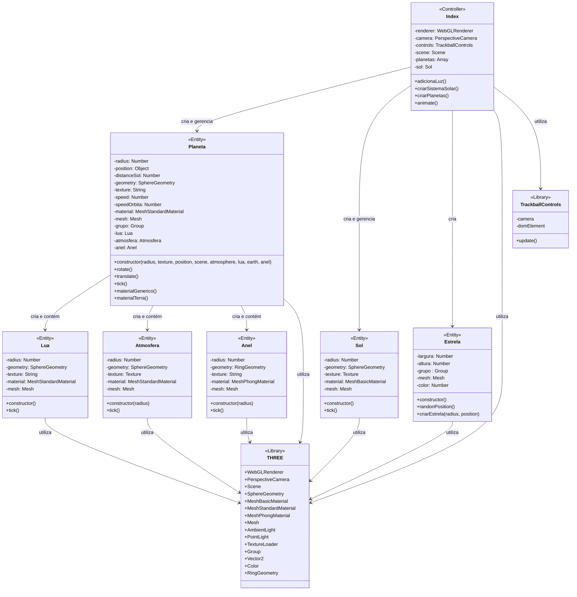

# Repositório de Computação Gráfica

Este repositório contém trabalhos desenvolvidos para a disciplina de Computação Gráfica, focando em aplicações práticas de renderização 3D, animações e simulações gráficas.
<br><br>
[]()
[](https://wakatime.com/badge/user/5a343522-23db-45ae-b20b-54655c392390/project/124beb58-3e33-4c8a-aec4-33dc1bf1bcfc)


## Sumário - Sistema Solar 3D

- [Descrição do Projeto](#descrição-do-projeto)
- [Características](#características)
- [Capturas de Tela](#capturas-de-tela)
- [Tecnologias Utilizadas](#tecnologias-utilizadas)
- [Estrutura do Projeto](#estrutura-do-projeto)
- [Diagrama de Classes](#diagrama-de-classes)
- [Como Executar](#como-executar)
  - [Controles](#controles)
- [Implementação](#implementação)
  - [Detalhes da Implementação das Classes](#detalhes-da-implementação-das-classes)
- [Desafios e Soluções](#desafios-e-soluções)
- [Referências](#referências)


## Sistema Solar - Primeira Atividade

### Descrição do Projeto

Este projeto implementa uma simulação 3D do Sistema Solar utilizando a biblioteca Three.js. A aplicação renderiza o Sol e os planetas do Sistema Solar com suas respectivas órbitas, rotações e características visuais.

### Características

- Renderização 3D de alta qualidade com WebGL
- Simulação de órbitas planetárias com velocidades proporcionais às distâncias
- Texturas realistas para cada planeta
- Controle de câmera interativo com TrackballControls
- Iluminação ambiental e solar
- Terra com mapa normal e camada de nuvens
- Lua orbitando a Terra

### Capturas de Tela


<br>
*Visão panorâmica de todo o sistema solar*


<br>
*Close na Terra mostrando detalhes das nuvens*

### Tecnologias Utilizadas

- [Three.js](https://threejs.org/) - Biblioteca JavaScript para gráficos 3D
- WebGL - API para renderização gráfica no navegador
- JavaScript ES6+ - Linguagem de programação moderna
- HTML5 e CSS3 - Estruturação e estilização da interface
- NPM - Gerenciamento de dependências
- Vite - Ambiente de desenvolvimento rápido

### Requisitos do Sistema

- **Navegadores Compatíveis**: Chrome 90+, Firefox 88+, Safari 14+, Edge 90+
- **Hardware Recomendado**: 
  - GPU dedicada recomendada para melhor desempenho
  - Mínimo de 4GB de RAM
  - Processador: Intel i5 (7ª geração ou superior) ou equivalente
- **Dispositivos Móveis**: Compatível com smartphones e tablets
- **Conexão de Internet**: Necessária apenas para o carregamento inicial das texturas


### Estrutura do Projeto

```
/
├── index.html           # Página principal da aplicação
├── src/
│   ├── index.js          # Arquivo principal com inicialização da cena
│   ├── planeta.js       # Classe para criação e controle dos planetas
│   ├── sol.js           # Classe para criação e controle do sol
│   ├── lua.js           # Classe para criação e controle do sol
│   ├── atmosfera.js     # Classe para criação da atmosfera (nuvens) da Terra
│   ├── anel.js          # Classe para criação dos anéis de Saturno
│   ├── estrela.js       # Classe para criação do campo de estrelas de fundo
│   └── assets/
│       └── textures/    # Texturas dos planetas e do sol
│       ├── 8k_sun.jpg
│       ├── 8k_mercury.jpg
│       ├── 8k_venus_surface.jpg
│       ├── 8k_earth_daymap.jpg
│       ├── 8k_mars.jpg
│       ├── 8k_jupiter.jpg
│       ├── 8k_saturn.jpg
│       ├── 8k_saturn_ring_alpha.png
│       ├── 2k_neptune.jpg
│       └── 2k_uranus.jpg
```


### Diagrama de Classes

O diagrama a seguir ilustra a estrutura de classes da aplicação e seus relacionamentos:




## Como Executar

1. Clone o repositório:
   ```bash
   git clone https://github.com/StephanyeCunto/ComputacaoGrafica
   ```

2. Navegue até a pasta do projeto:
   ```bash
   cd Sistema_Solar/Sistema_Solar_3D
   ```

3. Instale as dependências:
   ```bash
   npm install
   ```

4. Execute o servidor de desenvolvimento:
   ```bash
   npm start
   ```

5. Abra o navegador e acesse `http://localhost:3000`

### Controles

- **Rotação da câmera**: Clique e arraste com o mouse
- **Zoom**: Use a roda do mouse ou pinça (em dispositivos touch)
- **Pan**: Clique com o botão direito e arraste

### Implementação

O código está estruturado em classes e funções modulares:

- `index.js`: Configura o renderer, câmera, controles e cena. Gerencia a animação.
- `planeta.js`: Classe responsável pela criação e comportamento dos planetas.
- `lua.js`: Classe para simular a lua e sua órbita.
- `sol.js`: Classe dedicada à criação e comportamento do Sol.
- `atmosfera.js`: Classe para simular a camada de nuvens da Terra.
- `anel.js`: Classe para criar e gerenciar os anéis de Saturno.
- `estrela.js`: Classe para implementar um campo de estrelas como background.

#### Detalhes da Implementação das Classes

1. **`Planeta`**:
   - Encapsula a criação, renderização e comportamento de cada planeta
   - Gerencia componentes associados como lua e atmosfera
   - Implementa movimentos de rotação e translação com física simplificada

2. **`Sol`**:
   - Centro do sistema simulado
   - Implementa material emissivo para simular luz própria
   - Fonte de iluminação para os planetas (PointLight)

3. **`Lua`**:
   - Satélite natural com órbita própria em torno da Terra
   - Sincronização de movimento com o planeta hospedeiro

4. **`Atmosfera`**:
   - Camada adicional para representar nuvens terrestres
   - Material semi-transparente com animação própria

5. **`Anel`**:
   - Geometria específica para os anéis de Saturno
   - Textura com canal alpha para transparência

6. **`Estrela`**:
   - Sistema otimizado para renderizar milhares de pontos
   - Distribuição aleatória para criar o efeito de céu estrelado

7. **`Index (Arquivo principal)`**:
   - Configura o ambiente de renderização
   - Gerencia o ciclo de animação


### Desafios e Soluções

- **Órbitas Planetárias**: 
  - **Desafio**: Conseguir simulação precisa das órbitas elípticas com período correto.
  - **Solução**: Implementação das leis de Kepler usando equações paramétricas e ajuste das velocidades baseado na distância ao Sol.

- **Iluminação Realista**: 
  - **Desafio**: Criar iluminação convincente e sombras realistas.
  - **Solução**: Utilizamos PointLight para o Sol e configuramos materiais com propriedades reflectivas corretas. Ajustes nos parâmetros de roughness e metalness para cada planeta.

## Referências

- [Documentação do Three.js](https://threejs.org/docs/)
- [Solar System Scope](https://www.solarsystemscope.com/) - Referência visual
- [NASA Solar System Exploration](https://solarsystem.nasa.gov/) - Texturas e informações sobre os planetas

---
<div align="center">
  <p>Desenvolvido como projeto para a disciplina de Computação Gráfica</p>
  <p>© 2025 - <a href="https://github.com/StephanyeCunto">Stephanye Cunto</a></p>
</div>