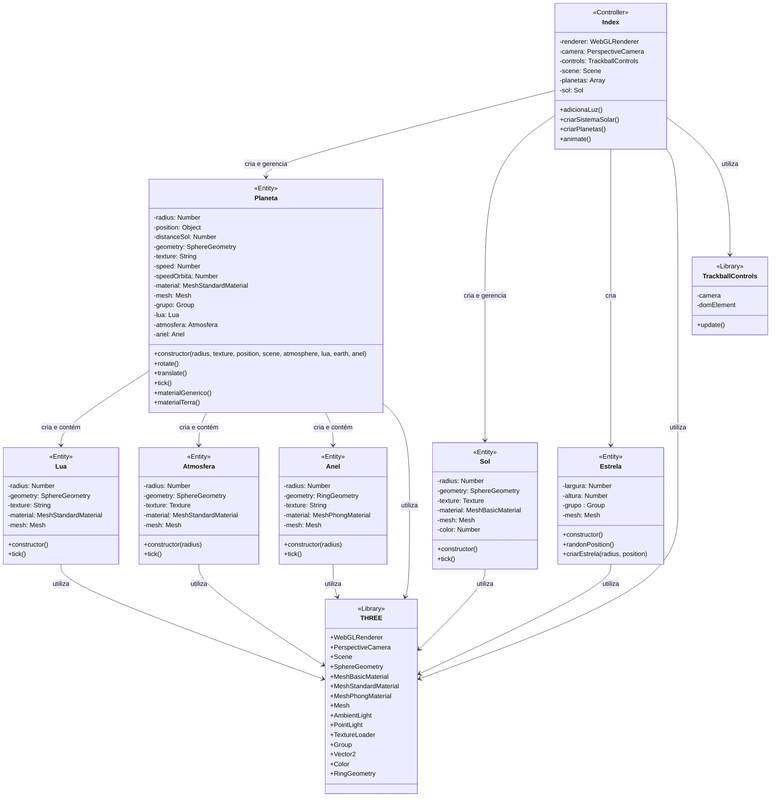

# Sistema Solar 3D - Primeira Atividade

Uma simulação 3D interativa do Sistema Solar desenvolvida com Three.js como parte da disciplina de Computação Gráfica.A aplicação renderiza o Sol, algumas estrelas e os planetas do Sistema Solar com suas respectivas órbitas, rotações e características visuais.
<br>

[]()
[]()
[]()

### Características

- Renderização 3D de alta qualidade com WebGL
- Simulação de órbitas planetárias com velocidades proporcionais às distâncias
- Texturas realistas para cada planeta
- Controle de câmera interativo com TrackballControls
- Iluminação ambiental e solar
- Terra com mapa normal e camada de nuvens
- Lua orbitando a Terra

## 📑 Sumário

- [Visão Geral](#-visão-geral)
- [Funcionalidades](#-funcionalidades)
- [Demonstração](#-demonstração)
- [Tecnologias](#tecnologias_utilizadas) 
- [Arquitetura](#-arquitetura)
  - [Estrutura do Projeto](#estrutura-do-projeto)
  - [Diagrama de Classes](#diagrama-de-classes)
- [Instalação e Execução](#-instalação-e-execução)
- [Controles e Interação](#-controles-e-interação)
- [Detalhes Técnicos](#-detalhes-técnicos)
  - [Classes Principais](#classes-principais)
  - [Renderização e Performance](#renderização-e-performance)
- [Desafios e Soluções](#-desafios-e-soluções)
- [Requisitos de Sistema](#-requisitos-de-sistema)
- [Referências](#-referências)

## 🌌 Visão Geral

O projeto **Sistema Solar 3D** apresenta uma simulação astronômica interativa com escalas, texturas e comportamentos orbitais realistas. Esta simulação permite explorar e visualizar o Sol, os oito planetas principais com suas características distintivas, e detalhes adicionais como a Lua terrestre e os anéis de Saturno.

Desenvolvido como parte da disciplina de Computação Gráfica, o projeto demonstra a aplicação prática dos conceitos de renderização 3D, iluminação, texturas e animação em tempo real utilizando WebGL através da biblioteca Three.js.

## ✨ Funcionalidades

- **Simulação Astronômica Precisa**:
  - Órbitas planetárias com velocidades proporcionais às distâncias reais
  - Rotação de cada planeta em seu próprio eixo
  - Representação de tamanhos em escala relativa

- **Elementos Visuais Detalhados**:
  - Texturas de alta resolução (8K) para planetas e Sol
  - Terra com camada atmosférica (nuvens) e mapa normal para topografia
  - Lua em órbita ao redor da Terra
  - Anéis detalhados para Saturno
  - Campo de estrelas como plano de fundo

- **Interatividade Completa**:
  - Controle total da câmera (rotação, zoom, deslocamento)
  - Visualização livre de qualquer ângulo do sistema solar
  - Performance otimizada para navegação suave

## 📸 Demonstração


<br>
*Visão panorâmica de todo o sistema solar*


<br>
*Close na Terra mostrando detalhes das nuvens*

## 🔧 Tecnologias

- **Core**:
  - [Three.js](https://threejs.org/) - Biblioteca JavaScript para gráficos 3D
  - WebGL - API para renderização gráfica no navegador
  - JavaScript ES6+ - Linguagem de programação

- **Ferramentas de Desenvolvimento**:
  - Vite - Ambiente de desenvolvimento rápido
  - NPM - Gerenciamento de dependências
  - HTML5/CSS3 - Estrutura e estilo da interface

- **Recursos**:
  - Texturas de alta resolução (8K/2K)
  - TrackballControls para interação com a câmera
  - Shaders personalizados para efeitos visuais

## 🏗️ Arquitetura

### Estrutura do Projeto

```
/
├── index.html           # Página principal da aplicação
├── src/
│   ├── index.js         # Inicialização da cena e controlador principal
│   ├── components/
│   │   ├── planeta.js   # Classe para criação e controle dos planetas
│   │   ├── sol.js       # Classe para criação e controle do sol
│   │   ├── lua.js       # Classe para criação e controle da lua
│   │   ├── atmosfera.js # Classe para criação da atmosfera da Terra
│   │   ├── anel.js      # Classe para criação dos anéis de Saturno
│   │   └── estrela.js   # Classe para criação do campo de estrelas
│   └── assets/
│       └── textures/    # Texturas dos planetas e do sol
│           ├── 8k_sun.jpg
│           ├── 8k_mercury.jpg
│           ├── 8k_venus_surface.jpg
│           ├── 8k_earth_daymap.jpg
│           ├── 8k_earth_clouds.jpg
│           ├── 8k_earth_normal.jpg
│           ├── 8k_moon.jpg
│           ├── 8k_mars.jpg
│           ├── 8k_jupiter.jpg
│           ├── 8k_saturn.jpg
│           ├── 8k_saturn_ring_alpha.png
│           ├── 2k_neptune.jpg
│           └── 2k_uranus.jpg
└── package.json         # Dependências e scripts
```

### Diagrama de Classes

O diagrama abaixo ilustra as relações entre as classes do sistema:



## 🚀 Instalação e Execução

1. **Pré-requisitos**:
   - Node.js (versão 14 ou superior)
   - NPM 

2. **Clone o repositório**:
   ```bash
   git clone https://github.com/StephanyeCunto/ComputacaoGrafica
   ```

3. **Navegue até o diretório do projeto**:
   ```bash
   cd ComputacaoGrafica/Sistema_Solar/Sistema_Solar_3D
   ```

4. **Instale as dependências**:
   ```bash
   npm install
   ```

5. **Inicie o servidor de desenvolvimento**:
   ```bash
   npm start
   ```

6. **Acesse a aplicação**:
   Abra seu navegador e visite `http://localhost:3000`

## 🎮 Controles e Interação

A simulação oferece controles intuitivos para explorar todo o Sistema Solar:

- **Rotação da Câmera**: Clique e arraste com o botão esquerdo do mouse
- **Zoom**: Utilize a roda do mouse ou gesto de pinça em dispositivos touch
- **Movimentação Lateral**: Clique com o botão direito do mouse e arraste

## 🔍 Detalhes Técnicos

### Implementação

O código está estruturado em classes e funções modulares:

- `index.js`: Configura o renderer, câmera, controles e cena. Gerencia a animação.
- `planeta.js`: Classe responsável pela criação e comportamento dos planetas.
- `lua.js`: Classe para simular a lua e sua órbita.
- `sol.js`: Classe dedicada à criação e comportamento do Sol.
- `atmosfera.js`: Classe para simular a camada de nuvens da Terra.
- `anel.js`: Classe para criar e gerenciar os anéis de Saturno.
- `estrela.js`: Classe para implementar um campo de estrelas como background.

### Classes Principais

   1. **Classe planeta**:
      - Responsável pela criação dos planetas
      - Gerencia as propriedades físicas como raio, posição e velocidade
      - Implementa o comportamento de rotação e órbita
      - Configura materiais e texturas específicas para cada planeta
      - No caso da Terra, cria uma instância da classe Lua e gerencia as nuvens

2. **Classe Lua**:
   - Implementa o satélite natural da Terra
   - Gerencia a órbita em torno da Terra
   - Usa textura específica para representação realista
     
3. **Classe Sol**:
    - Implementa o corpo central do sistema solar
    - Cria uma esfera com textura solar e material básico emissivo
    - Realiza rotação sobre seu próprio eixo
    
4. **Classe Atmosfera**:
   - Simula a camada de nuvens da Terra
   - Utiliza material semi-transparente
   - Possui rotação própria mais rápida que o planeta

5. **Classe Anel**:
   - Implementa os anéis de Saturno
   - Utiliza uma geometria de anel com textura transparente
   - Possui inclinação e rotação próprias

6. **Classe Estrela**:
    - Implementa um campo de estrelas como pano de fundo para a cena
    - Cria milhares de pontos luminosos posicionados aleatoriamente em 3D
    - Utiliza THREE.Points e BufferGeometry para renderização eficiente
    - Evita posicionar estrelas próximas ao centro da cena (onde está o sistema solar)

7. **Index (Arquivo principal)**:
   - Configura o ambiente de renderização
   - Gerencia o ciclo de animação
   - Cria e organiza todos os objetos do sistema solar
   - Implementa iluminação e controles de câmera

### Renderização e Performance

- **Otimizações**:
  - Utilização de `BufferGeometry` para objetos complexos
  - Gerenciamento eficiente de texturas com `TextureLoader`
  - Culling de faces para reduzir carga de renderização

- **Iluminação**:
  - Combinação de `AmbientLight` e `PointLight` para iluminação realista
  - Materiais configurados com propriedades físicas específicas

## 💡 Desafios e Soluções

| Desafio | Solução Implementada |
|---------|----------------------|
| **Órbitas Planetárias Realistas** | Implementação das leis de Kepler com equações paramétricas e ajuste dinâmico das velocidades com base na distância ao Sol |
| **Renderização de Alta Performance** | Otimização de geometrias, uso de LOD (Level of Detail) dinâmico e técnicas de culling para manter FPS estável |
| **Iluminação Solar Convincente** | Combinação de material emissivo para o Sol e PointLight estrategicamente posicionada para criar sombras e iluminação realistas |
| **Anéis de Saturno** | Uso de RingGeometry com textura alpha personalizada e ajuste de orientação para simular a inclinação característica |
| **Campo de Estrelas** | Implementação eficiente com Points e distribuição estatística para criar profundidade visual sem comprometer o desempenho |

## 💻 Requisitos de Sistema

- **Navegadores Compatíveis**: 
  - Chrome 90+
  - Firefox 88+
  - Safari 14+
  - Edge 90+

- **Hardware Recomendado**:
  - GPU com suporte a WebGL 2.0
  - Mínimo de 4GB de RAM
  - Processador: Intel i5 (7ª geração ou superior) ou equivalente
  
- **Dispositivos Móveis**:
  - iOS 14+ ou Android 10+
  - Mínimo de 4GB de RAM

- **Conexão de Internet**:
  - Necessária apenas para carregamento inicial das texturas

## 📚 Referências

- [Documentação do Three.js](https://threejs.org/docs/)
- [Solar System Scope](https://www.solarsystemscope.com/) - Referência visual e dados orbitais
- [NASA Solar System Exploration](https://solarsystem.nasa.gov/) - Texturas e informações astronômicas
- [NASA Planetary Fact Sheet](https://nssdc.gsfc.nasa.gov/planetary/factsheet/) - Dados precisos sobre planetas
- [Wikipedia - Sistema Solar](https://pt.wikipedia.org/wiki/Sistema_Solar) - Informações gerais

---
<div align="center">
  <p>Desenvolvido como projeto para a disciplina de Computação Gráfica</p>
  <p>© 2025 - <a href="https://github.com/StephanyeCunto">Stephanye Cunto</a></p>
</div>