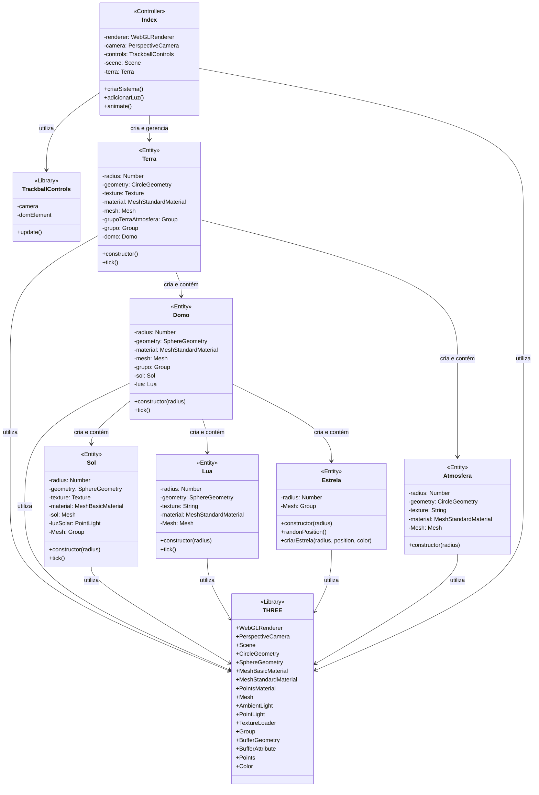

# Terra Plana - Segunda Atividade

Uma simulação 3D interativa da Terra Plana desenvolvida com Three.js como parte da disciplina de Computação Gráfica.A aplicação renderiza o Sol,a Lua, algumas estrelas e a Terra com suas respectivas órbitas, rotações e características visuais.

<br>


[]()
[]()
[]()

### Características

- Renderização 3D de alta qualidade com WebGL
- Simulação de órbitas solares e lunares acima do plano terrestre
- Texturas realistas para a Terra, Sol e Lua
- Controle de câmera interativo com TrackballControls
- Iluminação ambiental e solar
- Domo celeste transparente com campo de estrelas
- Movimento cíclico do Sol e da Lua

## 📑 Sumário

- [Visão Geral](#-visão-geral)
- [Funcionalidades](#-funcionalidades)
- [Demonstração](#-demonstração)
- [Tecnologias](#tecnologias_utilizadas) 
- [Arquitetura](#-arquitetura)
  - [Estrutura do Projeto](#estrutura-do-projeto)
  - [Diagrama de Classes](#diagrama-de-classes)
- [Instalação e Execução](#-instalação-e-execução)
- [Controles e Interação](#-controles-e-interação)
- [Detalhes Técnicos](#-detalhes-técnicos)
  - [Classes Principais](#classes-principais)
  - [Renderização e Performance](#renderização-e-performance)
- [Desafios e Soluções](#-desafios-e-soluções)
- [Requisitos de Sistema](#-requisitos-de-sistema)
- [Referências](#-referências)

## 🌌 Visão Geral

O projeto **Terra Plana** apresenta uma simulação interativa baseada no modelo cosmológico alternativo da Terra Plana. Este modelo visualiza a Terra como um disco circular plano coberto por um domo celeste hemisférico, com o Sol e a Lua orbitando acima da superfície terrestre.
Desenvolvido como parte da disciplina de Computação Gráfica, o projeto demonstra a aplicação prática dos conceitos de renderização 3D, iluminação, texturas e animação em tempo real utilizando WebGL através da biblioteca Three.js.

## ✨ Funcionalidades

- **Simulação Cosmológica Alternativa:**

    - Terra representada como um disco circular plano
    - Domo celeste hemisférico transparente
    - Sol e Lua orbitando em movimentos cíclicos acima da superfície
    - Estrelas distribuídas no domo celeste

- **Elementos Visuais Detalhados:**

    - Textura de alta resolução (8K) para a superfície terrestre
    - Sol com iluminação própria e efeito de luz que ilumina a Terra
    - Lua com textura detalhada e movimento orbital complementar ao Sol
    - Campo de estrelas como plano de fundo no domo celeste

- **Interatividade Completa:**

    - Controle total da câmera (rotação, zoom, deslocamento)
    - Visualização livre de qualquer ângulo do modelo
    - Performance otimizada para navegação suave

## 📸 Demonstração


<br>
*Visão panorâmica da Terra Plana e seu domo celeste*

### Tecnologias Utilizadas

- **Core**:
  - [Three.js](https://threejs.org/) - Biblioteca JavaScript para gráficos 3D
  - WebGL - API para renderização gráfica no navegador
  - JavaScript ES6+ - Linguagem de programação

- **Ferramentas de Desenvolvimento**:
  - Vite - Ambiente de desenvolvimento rápido
  - NPM - Gerenciamento de dependências
  - HTML5/CSS3 - Estrutura e estilo da interface

- **Recursos**:
  - Texturas de alta resolução (8K/2K)
  - TrackballControls para interação com a câmera
  - Shaders personalizados para efeitos visuais

## 🏗️ Arquitetura

### Estrutura do Projeto

```
/
├── index.html           # Página principal da aplicação
├── src/
│   ├── index.js         # Arquivo principal com inicialização da cena
│   ├── terra.js         # Classe para criação do disco terrestre
│   ├── domo.js          # Classe para criação do domo celeste
│   ├── sol.js           # Classe para criação e controle do sol
│   ├── lua.js           # Classe para criação e controle da lua
│   ├── estrela.js       # Classe para criação do campo de estrelas
│   └── assets/
│       └── textures/    # Texturas dos elementos
│           ├── 8k_sun.jpg
│           ├── 8k_earth_daymap.jpg
│           ├── 8k_earth_normal.jpg
│           ├── 8k_moon.jpg
```

### Diagrama de Classes

O diagrama abaixo ilustra as relações entre as classes do sistema:



## 🚀 Instalação e Execução

1. **Pré-requisitos**:
   - Node.js (versão 14 ou superior)
   - NPM 

2. **Clone o repositório**:
   ```bash
   git clone https://github.com/StephanyeCunto/ComputacaoGrafica
   ```

3. **Navegue até o diretório do projeto**:
   ```bash
   cd ComputacaoGrafica/Sistema_Solar/Sistema_Solar
   ```

4. **Instale as dependências**:
   ```bash
   npm install
   ```

5. **Inicie o servidor de desenvolvimento**:
   ```bash
   npm start
   ```

6. **Acesse a aplicação**:
   Abra seu navegador e visite `http://localhost:3000`

## 🎮 Controles e Interação

A simulação oferece controles intuitivos para explorar todo o Sistema Solar:

- **Rotação da Câmera**: Clique e arraste com o botão esquerdo do mouse
- **Zoom**: Utilize a roda do mouse ou gesto de pinça em dispositivos touch
- **Movimentação Lateral**: Clique com o botão direito do mouse e arraste

## 🔍 Detalhes Técnicos

### Implementação

O código está estruturado em classes e funções modulares:

- `index.js`: Configura o renderer, câmera, controles e cena. Gerencia a animação.
- `terra.js`: Classe responsável pela criação do disco terrestre plano.
- `domo.js`: Classe para criar o domo celeste semiesférico.
- `atmosfera.js`: Classe para simular a camada de nuvens da Terra.
- `sol.js`: Classe dedicada à criação e movimento do Sol.
- `lua.js`: Classe para criar e controlar o movimento da Lua.
- `estrela.js`: Classe para implementar um campo de estrelas como background.

#### Detalhes da Implementação das Classes

1. **`Terra`**:
   - Implementa um disco plano com textura terrestre
   - Serve como base fixa para todo o sistema
   - Gerencia o domo celeste como componente associado

2. **`Domo`**:
   - Cria uma semiesfera transparente sobre o disco da Terra
   - Contém Sol, Lua e campo de estrelas
   - Implementa materiais translúcidos para efeito visual
       
3. **`Classe Atmosfera`**:
   - Simula a camada de nuvens da Terra
   - Utiliza material semi-transparente
   - Possui rotação própria mais rápida que o planeta

4. **`Sol`**:
   - Esfera luminosa que orbita dentro do domo
   - Implementa material emissivo para simular luz própria
   - Inclui uma fonte de luz pontual para iluminar a Terra

5. **`Lua`**:
   - Satélite que orbita em sentido contrário ao Sol
   - Implementa material reflexivo para simulação realista

6. **`Estrela`**:
   - Sistema de partículas para criar o campo de estrelas
   - Distribui pontos aleatoriamente em uma semiesfera
   - Utiliza diferentes cores para maior realismo visual

7. **`Index (Arquivo principal)`**:
   - Configura o ambiente de renderização
   - Gerencia o ciclo de animação
   - Configura iluminação ambiente

### Renderização e Performance

- **Otimizações**:
    - Utilização de `BufferGeometry` para objetos complexos
    - Gerenciamento eficiente de texturas com `TextureLoader`
    - Uso de `Points` para renderização eficiente das estrelas

- **Iluminação**:

  - Combinação de `AmbientLight` e `PointLight` para iluminação realista


## 💡 Desafios e Soluções
| Desafio | Solução Implementada |
|---------|----------------------|
|**Representação do Domo**| Criação de uma semiesfera transparente com material que permite visualizar os corpos celestes através dele|
|**Movimento Orbital Solar e Lunar**| Implementação de equações paramétricas trigonométricas para criar movimentos complementares e cíclicos|
|**Distribuição Hemisférica das Estrelas**|Algoritmo específico para posicionamento aleatório em coordenadas esféricas limitadas a um hemisfério|
|**Iluminação Dinâmica da Terra**|Luz pontual acoplada ao movimento do Sol para criar iluminação variável na superfície terrestre|
|**Integração dos Elementos**|Sistema de grupos hierárquicos para organizar e relacionar os diferentes elementos cosmológicos|


## 💻 Requisitos de Sistema

- **Navegadores Compatíveis**: 
  - Chrome 90+
  - Firefox 88+
  - Safari 14+
  - Edge 90+

- **Hardware Recomendado**:
  - GPU com suporte a WebGL 2.0
  - Mínimo de 4GB de RAM
  - Processador: Intel i5 (7ª geração ou superior) ou equivalente
  
- **Dispositivos Móveis**:
  - iOS 14+ ou Android 10+
  - Mínimo de 4GB de RAM

- **Conexão de Internet**:
  - Necessária apenas para carregamento inicial das texturas

## 📚 Referências

- [Documentação do Three.js](https://threejs.org/docs/)
- [Solar System Scope](https://www.solarsystemscope.com/) - Referência visual
- [NASA Solar System Exploration](https://solarsystem.nasa.gov/) - Texturas e informações sobre os planetas
- [Flat Earth Society](https://www.tfes.org/) - Referência para o modelo cosmológico alternativo
- [Wikipedia - Modelo da Terra Plana ](https://pt.wikipedia.org/wiki/Terra_plana) - Informações sobre o modelo alternativo 
 
---
<div align="center">
  <p>Desenvolvido como projeto para a disciplina de Computação Gráfica</p>
  <p>© 2025 - <a href="https://github.com/StephanyeCunto">Stephanye Cunto</a></p>
</div>